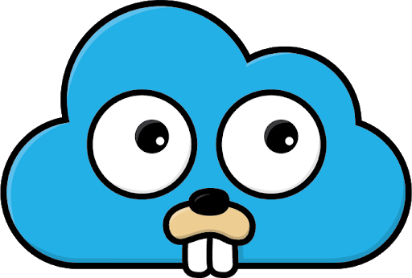

GoCloud
---
[](https://github.com/ksrichard/gocloud/actions/workflows/release.yml)
[](https://goreportcard.com/report/github.com/ksrichard/gocloud)
[](https://pkg.go.dev/github.com/ksrichard/gocloud)
[](https://github.com/ksrichard/gocloud)
[](https://github.com/ksrichard/gocloud/releases/latest/)


This project aims to make the creation of cloud based applications (including infrastructure, monitoring, apps etc...)
as easy as possible!

This project uses [pulumi](https://pulumi.com) for orchestrating the resources!

Before everything, let see a quick demo on setting up infrastructure + a sample application on Kubernetes in minutes!

https://terminalizer.com/view/d6249a2a4792


## Installation (homebrew)
You can install the CLI using homebrew (or local build, see next section):
```
brew tap ksrichard/tap
brew install gocloud
```

## Local build
- Build the CLI using the following command executed in the root of the project: `go build`
- You can use the new `gocloud` binary

## Options
```bash
$ gocloud
👍 Checking 'pulumi'...
👍 Getting latest changes from templates repository (https://github.com/ksrichard/gocloud-templates)...
Kick-start any cloud native project in your favourite programming language

Usage:
  gocloud [command]

Available Commands:
  down        Stop project
  help        Help about any command
  init        Initialize cloud-native project
  install     Setup and install project dependencies and switch to correct context
  listOutputs List outputs from Pulumi projects
  up          Start project

Flags:
  -h, --help                   help for gocloud
  -d, --template-dir string    Template directory to download and store project templates,
                               it can be set by setting GOCLOUD_TEMPLATE_DIR env variable as well (default "/Users/klavorar/gocloud-templates")
  -r, --template-repo string   Project template repository, it can be set by setting GOCLOUD_TEMPLATE_REPOSITORY env variable as well (default "https://github.com/ksrichard/gocloud-templates")

Use "gocloud [command] --help" for more information about a command.
```